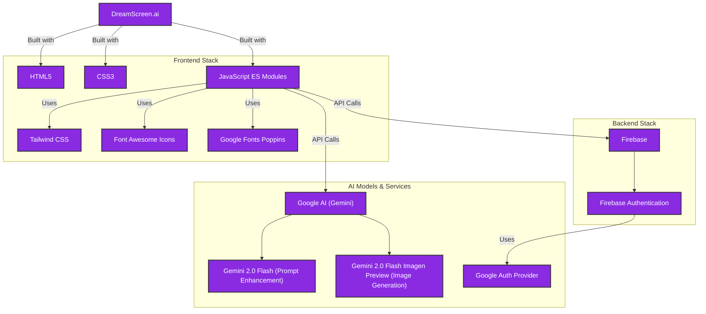

# **DreamScreen.ai**

**Create your perfect wallpaper**

**DreamScreen.ai** is a sleek, modern web application for generating custom wallpapers using AI. Users can sign in, describe their ideal wallpaper, select an art style, choose a device aspect ratio, and even enhance their prompts with AI for more vivid results.

## 🚀 **Demo**

[Live Demo >](https://dreamscreen-ai.web.app/)

> **Note:** API keys and database credentials have been omitted from the codebase because of security reasons.

---

## ✨ Key Features

- **AI Wallpaper Generation**: Generate high-quality, custom wallpapers from simple text descriptions.

- **AI Prompt Enhancement**: Automatically improve and add detail to your prompts with a single click using AI.

- **Multiple Art Styles**: Choose from a variety of styles, including Photorealistic, Minimalist, Anime, Fantasy, Cyberpunk, and more.

- **Device-Specific Aspect Ratios**: Create wallpapers perfectly formatted for Mobile (9:16), Desktop (16:9), Tablet (4:3), Ultrawide (21:9), and Profile Pics (1:1).

- **Secure User Authentication**: Full sign-in, sign-up, password reset, and email verification flow (Email/Password & Google Login).

- **Modern Glassmorphism UI**: A beautiful, responsive interface built with Tailwind CSS and custom glass-ui effects.

- **Responsive Design**: Fully responsive layout that works seamlessly on desktops, laptops, tablets, and mobile devices (iOS & Android).

---

## 🎨 Art Styles Available

- **Photorealistic**: Creates images that are indistinguishable from real photographs, focusing on lifelike detail, lighting, and textures.

- **Minimalist**: Focuses on simplicity, using a limited color palette and clean lines to expose the essence of the subject.

- **Anime**: Replicates the popular Japanese art style known for vibrant colors, distinct facial features (like large eyes), and dynamic, flat-shaded visuals.

- **Fantasy Art**: Generates mystical and magical scenes, depicting mythical creatures, enchanted landscapes, and epic adventures.

- **Cyberpunk**: Produces high-tech, futuristic cityscapes drenched in neon lights, often with a dark, dystopian atmosphere.

- **Pixel Art**: Creates charming, retro-style images reminiscent of classic 8-bit and 16-bit video games, built pixel by pixel.

- **Abstract**: Uses shapes, colors, forms, and gestural marks to achieve an effect rather than representing visual reality.

---

## 🖼️ Aspect Ratios Supported

- **Mobile (9:16)**: A vertical format perfect for smartphone lock screens and backgrounds, filling the entire screen.

- **Laptop/Desktop (16:9)**: The standard widescreen format for most modern monitors, laptops, and HD televisions.

- **Tablet (4:3)**: A more "square" format that fits nicely on most tablets, such as the iPad, in both portrait and landscape orientation.

- **Ultrawide (21:9)**: A cinematic format designed for ultrawide monitors, offering an immersive, panoramic view.

- **Profile Pic (1:1)**: A perfect square, ideal for use as a profile picture on social media, Discord, or other apps.

---

## 🛠️ Technology Stack

**Frontend:** HTML5, CSS3, JavaScript (ES Modules)

**Styling:** Tailwind CSS, Google Fonts (Poppins), Font Awesome

**Backend & Authentication:** Firebase (Firebase Authentication)

**AI Models & Services:** Google Auth Provider, **Google Gemini 2.0 Flash** (for prompt enhancement), **Google Gemini 2.0 Flash Preview** (for image generation)

---

## 🚀 Getting Started

### Requirements:
- A modern web browser with JavaScript enabled.
- Stable internet connection for loading media and syncing data.

### Steps:
1. Visit the link.
2. Sign-Up or Login using email or Google.
3. Begin generating your customized wallpapers!

---

## 🤝 **Contributing**

Contributions are always welcome! Please follow these steps:

1. Fork the repository.
2. Create a new branch (`git checkout -b feature/your-feature`).
3. Commit your changes (`git commit -m 'Add your message'`).
4. Push to the branch (`git push origin feature/your-feature`).
5. Open a pull request.

---

## 🛡️ License

This project is shared publicly for learning and inspiration purposes only.

❌ You may **NOT** copy, reuse, redistribute, or modify this code.  
✅ You may view and learn from the code.

Copyright © | All rights reserved

---

Built with ❤️ to bring AI-powered art to your screens.